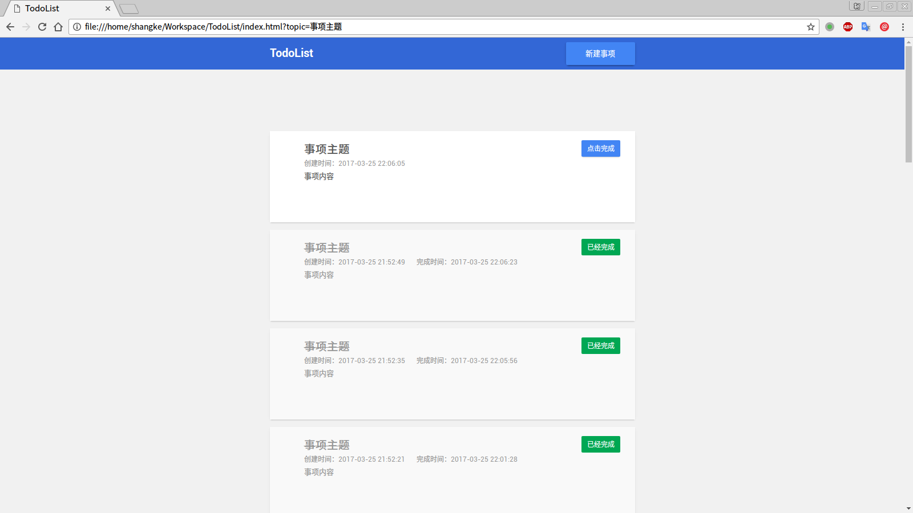

# 纯前端实现 TodoList

## 前端练手项目之一

### 技术栈

- HTML
- CSS
- JavaScript

### 项目目录结构

```
TodoList/
├── css/
│   └── theme.css
├── img/
│   ├── dialog.png
│   └── main-page.png
├── index.html
├── js/
│   ├── forms.js
│   ├── models.js
│   └── views.js
├── README.md
└── TODO.md
```

### UI 设计

整体 UI 参考了 Chrome 的下载页面

**界面截图**




简单说明：
- 按钮、任务卡、对话框阴影
- 按钮不同状态的简单动画
- 新建任务事项的对话框打开之后会有一个半透明的罩层覆盖在主页面上
- 对话框打开后主页面有一个虚化的动画

### 数据结构及其处理

**数据结构**

```
obj Assignment {
    id;             // 任务事项的唯一标示，使用创建时间的时间戳
    createDate;     // 任务事项的创建时间，默认通过 js 获取点击按钮时的时间
    topic;          // 任务事项的主题，不可为空
    content;        // 事项内容
    isComplete;     // 事项是否完成，创建时默认为 false , 知道用户点击完成
    completeDate;   // 事项完成日期，如果没完成则值为 null
}
```

数据的存储使用了 H5 的 `localStorage`
